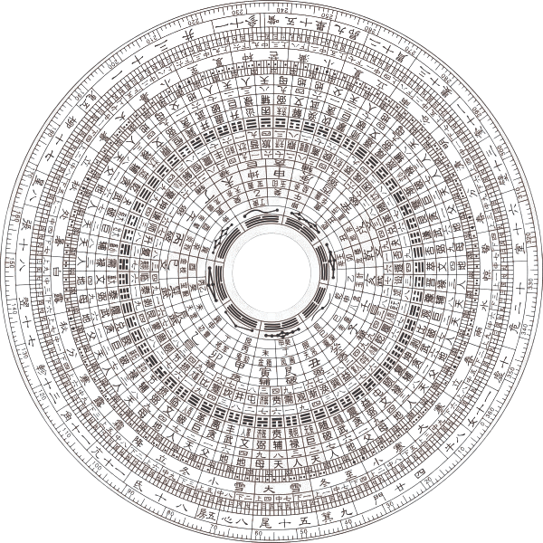

# 八卦盘小程序

一款基于微信小程序开发的电子八卦罗盘，用于占卜和寻求指引。当遇到难以抉择的事情时，可以通过问卜八卦来获得启发。

## 下载和体验

- [点击下载最新版本](https://github.com/xxxume/baguapan/releases/tag/%E5%BE%AE%E4%BF%A1%E5%85%AB%E5%8D%A6%E7%BD%97%E7%9B%98)
- 发布日期：2023-12-23
- 版本：v1.0.0

## 界面预览

  

## 主要功能

1. **电子罗盘转动**
   - 点击启动罗盘随机转动
   - 太极图持续旋转动画效果
   - 转动结束后震动反馈

   

     
     
   

2. **卦象解读**
   - 包含完整64卦的解读内容
   - 每一卦都包含详细的：
     - 卦象描述
     - 形势分析
     - 行动建议
     - 各方面详解（事业、感情、财运、健康等）

   

     
   

## 技术特点

1. **代码结构**
   - 采用微信小程序原生开发
   - 模块化的数据管理
   - 组件化的界面设计

2. **数据验证**
   - 完整的卦象数据验证机制
   - 自动修复数据顺序功能
   - 错误提示和异常处理

3. **性能优化**
   - 高效的动画实现
   - 合理的数据结构
   - 优化的用户体验

## 项目结构

## 图片资源说明

项目使用的主要图片资源：

1. **罗盘图片 (compass.png)**
   - 位置：`images/compass.png`
   - 用途：主界面罗盘背景
   - 尺寸：建议使用 600x600px
   - 格式：PNG（支持透明背景）

2. **太极图片 (taiji.png)**
   - 位置：`images/taiji.png`
   - 用途：罗盘中心旋转的太极图
   - 尺寸：建议使用 180x180px
   - 格式：PNG（支持透明背景）

## 自定义图片

如果您想替换默认图片：

1. 准备新的图片文件
2. 将图片文件重命名为 `compass.png` 和 `taiji.png`
3. 替换 `images` 目录下的对应文件
4. 注意保持图片尺寸比例一致

注意：图片尺寸过大可能会影响小程序的加载性能，建议进行适当压缩。

## 更新日志

### v1.0.0 (2023-12-23)
- 初始版本发布
- 实现基本的罗盘功能
- 完成64卦数据整理
- 添加基础动画效果
